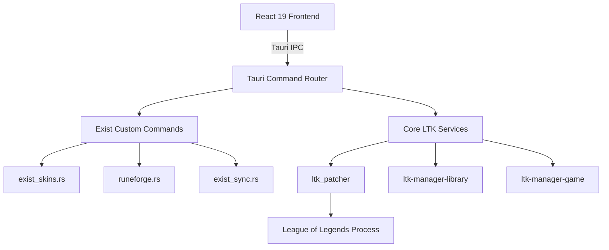

# System Patterns

## Architecture Overview

Exist LoL Manager operates as a Tauri v2 desktop application. It pairs a multi-crate Rust backend with a React 19 frontend.

## Backend Services (`src-tauri/src/commands/`)

- **`exist_skins.rs`:**
  - Manages curated catalog downloads and installation status.
  - Maintains `installed_skins.json` inside the application data directory.
  - Maps internal skin identifiers to active library mod entries.

- **`runeforge.rs`:**
  - Proxies queries to the RuneForge community API.
  - Downloads remote zip and `.fantome` packages asynchronously.
  - Extracts archives, saves `thumbnail.png`, and writes metadata to `runeforge/installed_mods.json`.

- **`exist_sync.rs`:**
  - Evaluates upstream releases against current installed versions.
  - Discovers release assets with `.exe` and `.msi` extensions.
  - Coordinates in-app downloads and automated installer execution.

## Frontend Layout & Routing

- **Routing:** TanStack Router driven by `src/routeTree.gen.ts`.
- **Pages:**
  - `src/pages/ExistSkinLibrary.tsx`: Unified skin library, champion view, RuneForge browser, and installed tab.
  - `src/routes/skins.tsx`: Entry route mapping `/skins`.
- **State Management:**
  - TanStack Query for remote catalog and RuneForge queries.
  - Local React hooks and context for active selection states.
  - IPC bindings in `src/lib/tauri.ts` wrapping `commands.*`.

## Storage & Configuration Files

- **Application Root:** `%APPDATA%\dev.leaguetoolkit.manager\` on Windows.
- **Log Files:** `%APPDATA%\dev.leaguetoolkit.manager\logs\ltk-manager.log`.
- **Curated Skin Registry:** `%APPDATA%\dev.leaguetoolkit.manager\installed_skins.json`.
- **RuneForge Registry:** `%APPDATA%\dev.leaguetoolkit.manager\runeforge\installed_mods.json`.
- **Library & Profiles:** `%APPDATA%\dev.leaguetoolkit.manager\library.json`.
- **Global Settings:** `%APPDATA%\dev.leaguetoolkit.manager\config.json`.

## Key System Invariants

1. **Selection Sync on Removal:**
   - When deleting or uninstalling any enabled mod, the frontend must issue `toggleMod(id, false)` before deletion.
   - Deleting without toggling leaves a dangling reference in the active profile inside `library.json`.

2. **Artwork Persistence:**
   - RuneForge downloads must supply `thumbnailKey` during install.
   - The backend stores `thumbnail.png` in the unpacked mod folder and logs it in `runeforge/installed_mods.json`.

3. **Accurate Counter Aggregation:**
   - The sidebar Installed counter combines curated catalog entries and local RuneForge mods.
   - Formula: `safeInstalled.length + localMods.filter(isRuneForgeMod).length`.

4. **Scan Exemption:**
   - `enforce_skinhack_scan` remains `false` in `crates/ltk-manager-base/src/config.rs`.
   - Prevents blocking champion-level skin modifications during patch preparation.
